# IZAJ Inventory Management System - Complete Flowchart

## Full System Flow


---

## Authentication Flow


---

## Product Request Lifecycle


---

## System Architecture


---

## Role-Based Access Control


---

## Database Schema Relationships


---

## Request Review Flow (Manager)


---

## Analytics Data Flow


---

## Notification Flow

```mermaid
sequenceDiagram
    participant U as User
    participant FE as Frontend
    participant BE as Backend
    participant DB as Database
    participant EM as Email Service
    participant MGR as Manager

    U->>FE: Create Product Request
    FE->>BE: POST /api/product-requests
    BE->>DB: Validate and Reserve Stock
    DB-->>BE: Success
    BE->>DB: Save Requisition
    BE->>DB: Log Audit
    BE->>EM: Send Notification
    EM-->>MGR: New Request Email
    BE-->>FE: Request Created
    FE-->>U: Success Message

    Note over MGR: Manager Reviews Request

    MGR->>FE: Approve/Deny Request
    FE->>BE: PUT /api/product-requests/:id/review
    BE->>DB: Update Stock if approved
    BE->>DB: Update Status
    BE->>DB: Log Audit
    BE->>EM: Send Notification
    EM-->>U: Request Status Email
    BE-->>FE: Review Complete
```



---

## Session Lifecycle


---

## API Endpoints Overview


---

## File Structure

```
IZAJ-Inventory/
├── src/                          # React Frontend
│   ├── components/
│   │   ├── Analytics/            # EOQ Dashboard
│   │   ├── AuditLogs/            # Activity logs
│   │   ├── Auth/                 # Login/Register
│   │   ├── Branch/               # Branch management
│   │   ├── Dashboard/            # Main dashboards
│   │   ├── Notifications/        # Alert system
│   │   └── Stock_Components/     # Inventory UI
│   ├── contexts/
│   │   └── AuthContext.tsx       # Session management
│   └── hooks/                    # Custom hooks
│
├── backend/Server/               # Node.js Backend
│   ├── server.js                 # Express app
│   ├── supabase.node.js          # DB client
│   ├── routes/
│   │   └── analytics.js          # Flask proxy
│   └── utils/                    # Helpers
│
├── analytics/                    # Python Analytics
│   ├── app.py                    # Flask app
│   ├── routes.py                 # API endpoints
│   └── eoq_calculator.py         # Algorithms
│
└── docs/                         # Documentation
    └── SYSTEM_FLOWCHART_MERMAID.md
```

---

**How to View:**

- **GitHub** - Renders Mermaid natively
- **VS Code** - Install "Markdown Preview Mermaid Support" extension
- **Online** - Paste at [mermaid.live](https://mermaid.live/)
